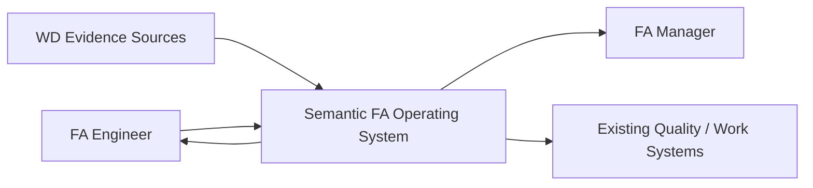
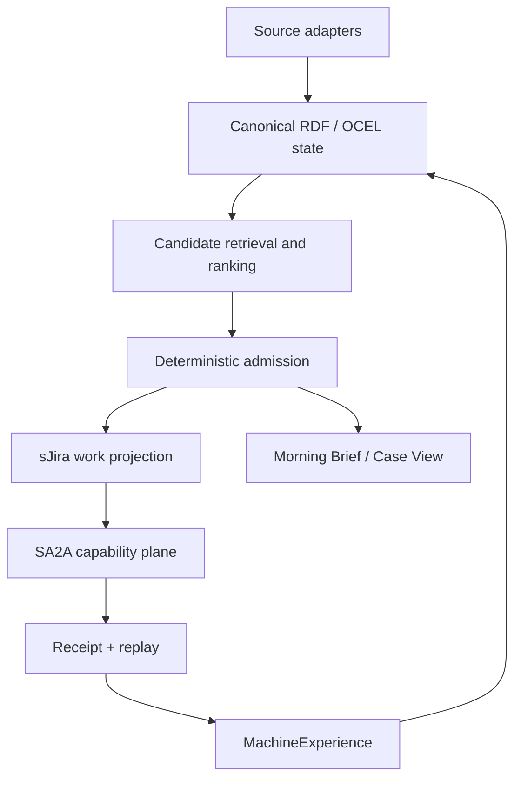
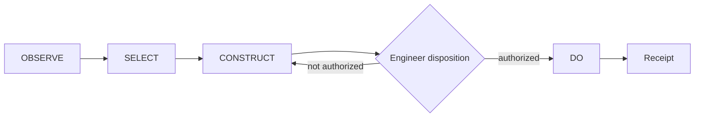
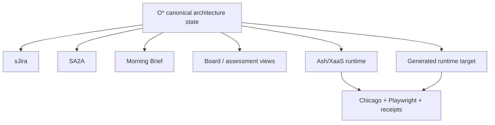

# C4 / Mermaid Architecture

## System context

## Containers

## Authority boundary

The Friday demo proves through CONSTRUCT plus the human gate. Production DO is outside the evidence ceiling.

## STOGAF projection

