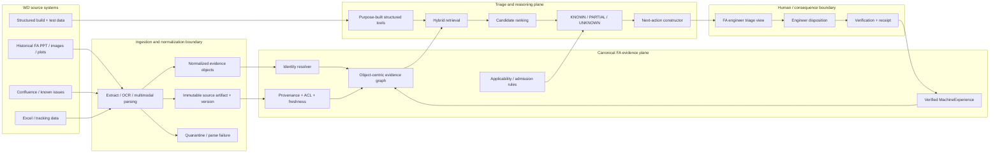

# Western Digital Case Study 2 — HDD Failure Analysis AI Agent

**Candidate:** Sean Chatman  
**Submission target:** September 25, 2026  
**Problem selected:** Case Study 2 — HDD Failure Analysis AI Agent  
**Implementation baseline inspected:** `seanchatmangpt/xaas` PR #62 head `7c457827dcfdb3e4809395df67f09611bbff37c8`, merged as `f9670f446537ddb882edf9cd7e0b6519de557e60`  
**Evidence ceiling:** repository-local design and fixture evidence only  
**Freeze:** FROZEN 2026-09-25 for the 08:00 PT presentation  
**Frozen subject:** `seanchatmangpt/xaas@70f7ea75df1d20a37666cd09050d5ec10a237892` (PR #69 merge of head `e2d9b22d`, tree-identical to it; carries the PR #68 freeze of PR #62 merge `f9670f44` plus the Semantic Case Study court)  
**Court report:** `wd-cs2-stogaf-semantic-report.json` sha256 `7e25a5869bcd9e7aa1335d04ccd356e9b4fc8d7eca0a7f7bfc94f67a15fe7ff1` (STOGAF_SEMANTIC_COURT_V2, standing ALIVE, 9 gates, 0 refusal rows; local replay on `git archive 70f7ea75` equals the digest printed by main push court run 36111479221 on `70f7ea75` and PR court run 36100453038 on `e2d9b22d`)  
**Runs cited:** PR #69 head `e2d9b22d`: STOGAF court 36100453038, exact-head court 36100453050, deck manufacture 36100453057, CI/CD Elixir 36100453024 (all success); PR #68 head `be8cbf06`: 36098848597, 36098848599, 36098848507, 36098848602 (all success); PR #62: 36082037670 / 36082037553 / 36082037511 on `7c457827`, CI/CD Elixir 36085665790 on `f9670f44`; push runs on `70f7ea75`: court 36111479221, exact-head 36111479272, deck 36111479344 (all success)  
**Case revision:** `case_revision_digest` `6bd9762edbdf7c8f2a267106343601c60eef8c5cf32f52e183b963cc6453806f` (claims ledger `docs/case-studies/wd-fa/claims-ledger.json`, 12 claims; `wd-deck case-study --check` drift-free in run 36100453057)

## Executive summary

I would build the HDD Failure Analysis system as a **governed quality loop**, not as a chatbot placed in front of a vector database.

The core problem is not merely retrieval. WD's case study describes a workflow in which engineers repeatedly reconstruct context from heterogeneous prior FA reports, Confluence, spreadsheets, images and plots, plus structured build and test history. A useful system must therefore do four things at once:

1. reconstruct the failed drive's exact evidence context;
2. retrieve and rank applicable prior art without confusing similarity with truth;
3. construct the next bounded diagnostic action while preserving engineering authority;
4. convert verified dispositions into reusable prior art so the same investigative work is not repeatedly purchased.

The proposed operating loop is:

```text
STANDARD / PRIOR ART
        |
        v
OBSERVE FAILED DRIVE + SYMPTOM
        |
        v
RECONSTRUCT EVIDENCE CONTEXT
        |
        v
RETRIEVE + RANK CANDIDATES
        |
        v
DETERMINISTIC ADMISSION
 KNOWN / PARTIAL / UNKNOWN
        |
        v
CONSTRUCT NEXT ACTION
        |
        v
ENGINEER DISPOSITION
        |
        v
VERIFY + RECEIPT
        |
        v
MACHINE EXPERIENCE
        |
        +--------------------> future prior art
```

The important boundary is:

> **Candidate ranking is not root-cause authority.**

Models may retrieve, summarize and rank hypotheses. A failure mode becomes **KNOWN** only when the required applicability conditions and evidence are satisfied. Missing or contradictory evidence produces **PARTIAL** or **UNKNOWN**, not a confident guess. In phase one, the engineer remains the authority for consequential disposition.

I would start with one bounded failure family, one representative historical corpus and shadow-only recommendations. I would not make production actuation, measured MTTR improvement, broad corpus migration or fully autonomous closure prerequisites for the first 30 days.

---

## 1. Problem framing and scope

### What I am solving

Given a failed drive and its reported symptom, the system should produce a decision-ready triage packet containing:

- a ranked set of probable failure modes;
- the evidence supporting and contradicting each candidate;
- the closest **applicable** prior FA cases;
- missing evidence required to resolve uncertainty;
- a specific next action, such as a named test, teardown step, owning-team route, known-issue closure path or escalation as a suspected novel failure;
- a visible confidence basis;
- the evidence provenance needed for an engineer to verify the recommendation;
- the authority boundary: what the system constructed versus what still requires engineering disposition.

The unit of value is not "an AI answer." It is **verified investigative work that does not need to be re-derived on the next applicable case**.

### Phase-one boundary

Phase one should prove that the system can reconstruct evidence, distinguish known from novel, preserve provenance and reduce repeated exploratory work for one bounded failure domain.

I would explicitly defer:

- automatic production disposition;
- automatic customer-impacting corrective action;
- unrestricted text-to-SQL against production data;
- migration of the entire fifteen-plus-year corpus before value is demonstrated;
- a globally complete enterprise ontology;
- broad autonomous execution across WD systems;
- claims of MTTR improvement before a measured shadow/pilot comparison exists.

### Questions already sent to WD and interim assumptions

On September 23 I sent three questions through Pradyot Kar. He confirmed that he would forward them to the WD team. I have not treated that forwarding confirmation as an answer. Until WD responds, the proposal uses the following explicit assumptions.

| Question sent to WD | What remains unknown | Interim assumption used here | What changes if the answer differs |
|---|---|---|---|
| When a failed drive comes in, what does the engineer actually do today, and where does the process usually get stuck? | Exact current workflow, handoffs, wait states and dominant bottleneck | Engineers spend material time reconstructing context and finding applicable prior art before selecting the next diagnostic step | I would remap the first vertical slice around the measured bottleneck rather than preserve my assumed workflow |
| When evidence disagrees — prior FA history, build data, current test results and engineer judgment — what is authoritative? | WD's precedence, escalation and ground-truth policy | No source is allowed to silently dominate; contradictions remain visible and consequential disposition stays with an engineer | Admission rules, evidence precedence and escalation policy would be revised to WD's actual governance model |
| If I had 30 days to prove usefulness, what data and systems would I realistically have access to, and what result would the team want to see first? | Accessible sources, security constraints, representative corpus and first success metric | Start with a bounded historical/redacted corpus plus whatever structured build facts WD can authorize; use shadow-only recommendations | The first 30-day slice and measurement plan would be narrowed or expanded around the actual access envelope |

These are not blockers. They are variables that determine the first lawful slice.

---

## 2. Solution architecture

### Architecture principle

The system should have **one canonical evidence state** and many projections. The engineer view, manager view, work queue, retrieval packet, audit record and evaluation output should not become competing sources of truth.

The implementation model I used in the accompanying prototype is:

```text
A = μ(O*)
```

where:

- `O*` is admitted, bounded evidence state;
- `μ` is a lawful transformation;
- `A` is a generated artifact such as a triage view, work item or verification receipt.

### Component and trust-boundary view



### Trust boundaries

1. **Source boundary.** Source ACL, classification, version and provenance are captured before evidence enters the reasoning plane.
2. **Normalization boundary.** Extracted text, image observations and plot interpretations are derived evidence, never silently promoted to source facts.
3. **Reasoning boundary.** Retrieval and models may manufacture candidates; they do not grant root-cause standing.
4. **Consequence boundary.** The phase-one system has **SELECT/CONSTRUCT** authority only. The engineer controls consequential disposition.
5. **Learning boundary.** A candidate does not become reusable MachineExperience until the disposition is verified and receipted.

### Build versus buy

I would **reuse/buy** commodity capabilities where WD already has approved infrastructure:

- document/object storage;
- OCR and document parsing;
- multimodal image extraction;
- embedding generation and vector search;
- queueing/event infrastructure;
- model hosting/inference;
- observability and secret management.

I would **build the WD-specific control plane**:

- failure-analysis subject and identity model;
- semantic join between FA evidence and build provenance;
- applicability/admission rules;
- evidence provenance and contradiction model;
- triage packet schema;
- KNOWN/PARTIAL/UNKNOWN state machine;
- human disposition boundary;
- MachineExperience admission/revocation;
- evaluation courts and replay receipts.

Those are the parts where WD's domain semantics and engineering authority live. Outsourcing them to a generic RAG framework would move the most important behavior into opaque prompt convention.

### Why not RAG-only?

RAG is useful inside this architecture, but RAG alone does not define:

- when a prior case is actually applicable;
- what evidence is mandatory;
- what contradiction invalidates a candidate;
- who has authority to close the case;
- how missing evidence is represented;
- how a verified result becomes reusable knowledge;
- how to reproduce why a recommendation was made.

Therefore retrieval is a capability, not the system of record.

---

## 3. Data and context model

### Primary objects

The minimum useful model is object-centric rather than one giant document index.

| Object | Purpose |
|---|---|
| FailureCase | Investigation identity, reported symptom, lifecycle and standing |
| Drive | Serial-linked physical subject |
| Build | Manufacturing/build context |
| Lot | Lot provenance |
| Supplier | Component provenance |
| BOMRevision | Component configuration |
| FirmwareRevision | Firmware/build relationship |
| TestStation | Station identity and test provenance |
| TestResult | Structured measurement/result |
| ReworkEvent | Rework history |
| EvidenceArtifact | PPT, slide, image, SEM capture, plot, waveform, Confluence page, spreadsheet row |
| Observation | Derived observation from an artifact or structured source |
| FailureMode | Candidate/known failure class |
| KnownIssue | Governed known-issue record |
| DiagnosticAction | Named test, teardown, routing or escalation action |
| Disposition | Engineer-authorized case outcome |
| MachineExperience | Verified, applicability-bounded reusable prior art |
| Receipt | Subject/evidence/verifier/outcome binding |

Important relations include:

```text
FailureCase -> Drive
Drive -> Build
Build -> Lot / Supplier / BOMRevision / FirmwareRevision / TestStation
FailureCase -> EvidenceArtifact
EvidenceArtifact -> Observation
FailureCase -> Candidate FailureMode
FailureMode -> required evidence
FailureMode -> falsifiers
FailureMode -> DiagnosticAction
Disposition -> verifies/refutes Candidate
Disposition -> may manufacture MachineExperience
MachineExperience -> applicability constraints
```

### Provenance

Every derived assertion should carry at least:

- source system;
- source object identity;
- source version or content digest;
- observed timestamp;
- extractor/parser version;
- transformation identity;
- classification/ACL binding;
- whether the value is observed, derived or inferred.

The engineer should be able to move from a recommendation back to the exact evidence artifact, not merely a generated citation label.

### Freshness and incremental update

I would use different refresh behavior for different evidence classes:

- **Historical FA corpus:** offline normalization with content-addressed versions; reprocess only changed/new artifacts or when an extractor version intentionally changes.
- **Known-issue/process documentation:** event-driven where possible, otherwise incremental polling with source version checks.
- **Structured build/test facts:** purpose-built query tools or CDC/materialized views depending latency and source-system constraints.
- **Active FA case state:** event-driven updates because it changes the next recommended action.
- **MachineExperience:** append/admit/supersede through an explicit governance transition, never by silent embedding refresh.

If an upstream source is unavailable, stale or partially parsed, the case does not get "completed" by model inference. Its standing narrows to PARTIAL or UNKNOWN and the missing evidence is surfaced.

### Storage shape

I would keep storage responsibilities explicit rather than put every concern into one database:

| Store / index | What it owns | What it does not own |
|---|---|---|
| Source system or governed raw object store | Original PPT, image, plot, spreadsheet and versioned source artifact | Root-cause interpretation |
| Relational operational store | Case identity, drive/build relations, provenance, ACL metadata, work state, dispositions | Approximate semantic similarity as authority |
| Vector / lexical indexes | Derived retrieval indexes keyed by source/content identity | Canonical truth or authorization |
| Semantic/graph projection | Typed object relations and applicability links | Independent copy of source evidence |
| Receipt / audit store | Append-only subject, evidence, verifier and outcome bindings | Mutable working notes |

The vector index is therefore disposable and rebuildable. Losing it degrades retrieval; it does not erase the evidence record.

### Cost, latency and scale envelope

The dominant cost risk is the fifteen-plus-year multimodal backfill, not the final prompt. I would control it with:

- content hashing so unchanged artifacts are never reprocessed accidentally;
- tiered extraction: cheap metadata/text extraction first, expensive image/plot interpretation only where the artifact type requires it;
- bounded reprocessing when extractor/model versions change;
- offline precomputation of embeddings, candidate metadata and image observations;
- query-time retrieval over a small evidence packet rather than replaying the corpus into a model;
- purpose-built structured tools to avoid repeated broad data-lake scans;
- per-stage telemetry for pages/images processed, model tokens, retrieval fan-out, latency and cost per triage.

At scale, likely pressure points are multimodal extraction throughput, duplicate/ambiguous identities, vector-index growth, high-cardinality graph joins and expensive structured queries. I would partition by stable domain keys, make ingestion idempotent, use queues/backpressure, cache immutable derived artifacts by digest and keep hot active-case state separate from cold historical source material.

I would not quote a credible dollar figure until WD supplies corpus size, image density, query volume, approved model/runtime pricing and retention requirements. In week one I would measure those variables and publish a cost model with one-time backfill cost separated from steady-state cost per case.

### Images, plots and waveforms

The system should preserve both the original artifact and derived machine-readable observations.

For an image-heavy PowerPoint slide, for example:

```text
source slide
  + exact file/version
  + image region
  + OCR text
  + visual/plot extraction
  + units/axes if recoverable
  + derived observation
  + confidence of extraction
  + link back to source pixels
```

A model-generated description of a waveform is useful for retrieval, but it is not equivalent to the waveform itself. Raw evidence remains inspectable.

---

## 4. Retrieval, reasoning and grounding

### Query-time sequence

For a new failed drive:

1. **Resolve the subject.** Establish case and drive identities. Do not begin from free text if authoritative identifiers are available.
2. **Reconstruct structured context.** Fetch lot, supplier, BOM, firmware, station, test and rework facts through curated tools.
3. **Assemble symptom/evidence context.** Bind current observations and available artifacts.
4. **Retrieve prior art.** Use hybrid lexical/vector retrieval plus graph/metadata filters to find candidate prior cases and known issues.
5. **Rank candidates.** A model or ranking layer may score likely failure modes and explain why.
6. **Apply deterministic admission.** Check applicability conditions, mandatory evidence, contradictions and falsifiers.
7. **Assign standing.**
   - **KNOWN:** applicability and required evidence close.
   - **PARTIAL:** a plausible known path exists but evidence is missing or contradictory.
   - **UNKNOWN:** no admitted known path explains the subject.
8. **Construct the next action.** Produce the smallest useful diagnostic step and its owner.
9. **Require engineer disposition** for consequential closure.
10. **Verify and learn.** Verified outcomes may become MachineExperience for future replay.

### What is precomputed versus query-time?

**Precomputed/offline:** document normalization, OCR, image/plot observations, embeddings, source digests, stable object identities where determinable, prior-case indexes, known-issue metadata and deterministic applicability definitions.

**Query-time:** exact drive/build reconstruction, current structured facts, ACL-filtered retrieval, candidate ranking, admission against current evidence, next-action construction and engineer-facing explanation.

This keeps expensive corpus work out of the interactive path while ensuring current drive facts are not frozen into stale summaries.

### Feedback without adding another engineer workflow

The default feedback mechanism should be the engineer's existing disposition/closure event, not a second AI-specific form. The system should capture the case outcome, selected root cause/known issue, diagnostic action and relevant evidence identities from that existing transition. It should request additional annotation only when the existing disposition is insufficient to manufacture safe reusable prior art. A verified closure may produce MachineExperience; an unverified candidate may not.

### Why a curated semantic layer instead of unrestricted text-to-SQL?

I would not put an LLM directly in front of a broad production warehouse and ask it to generate arbitrary SQL as the primary interface.

The first version should expose purpose-built tools such as:

```text
get_drive_build(serial)
get_test_history(serial, test_family)
get_rework_history(serial)
get_bom_revision(serial)
get_lot_supplier(serial)
get_station_history(serial)
get_prior_cases(failure_family, applicability_constraints)
```

The tool boundary gives WD:

- stable contracts;
- explainable joins;
- query cost control;
- ACL enforcement;
- input validation;
- audit logs;
- testable failure behavior.

Text-to-SQL can still be used behind an analyst-only or governed exploration boundary later. It should not be the sole trust mechanism for root-cause recommendations.

### Confidence signal

I would not show only a scalar "92% confidence."

The engineer should see a basis such as:

```text
Candidate: Failure Mode X
rank score: high
applicability: satisfied
required evidence: 6/6 present
contradictions: 0
closest applicable prior cases: 4
missing evidence: none
standing: KNOWN
source freshness: current / bounded
authority: engineer disposition required
```

For a partial case:

```text
Candidate: Failure Mode Y
rank score: high
applicability: conditionally matched
required evidence: 4/6 present
contradictions: 1 unresolved
missing evidence: teardown image + station retest
standing: PARTIAL
next action: collect missing evidence
```

That makes uncertainty operational.

### Preventing a confidently wrong root cause

The principal safety rule is:

> Similarity can nominate a candidate; similarity cannot make it KNOWN.

The admission layer should fail closed on:

- missing required evidence;
- incompatible firmware/BOM/lot conditions;
- contradicted measurements;
- stale or superseded known issues;
- inaccessible evidence;
- provenance gaps;
- failed parser/extractor provenance;
- ambiguous drive identity.

Negative controls are part of the evaluation set: deliberately similar-but-inapplicable cases must remain PARTIAL or UNKNOWN.

### Retry and partial failure behavior

A production-quality FDE design has to specify what happens when dependencies fail.

- Parser failure -> preserve source artifact, quarantine derived extraction, continue with reduced evidence.
- Data-lake tool timeout -> return BLOCKED/PARTIAL for facts that depend on it; never invent structured attributes.
- Confluence unavailable -> retain previously versioned evidence with explicit staleness, subject to WD policy.
- Vector index unavailable -> fall back to exact/metadata retrieval where possible; do not silently change evidence semantics.
- LLM unavailable -> deterministic retrieval/admission paths still function for already modeled known cases.
- Conflicting evidence -> surface conflict and route to engineer; do not average it away.
- Duplicate/replayed events -> content/subject identities make ingestion and receipt processing idempotent.

---

## 5. Security, permissions and governance

Security is part of the evidence model, not a post-launch filter.

### ACL propagation

A user should never gain access through the FA agent to evidence they could not lawfully access at the source.

For every evidence object, preserve:

- source ACL/security label;
- source identity;
- derivation lineage;
- derived-object restrictions.

For a derived artifact that combines multiple restricted sources, the safe default is the intersection of allowed access or the most restrictive governing classification until WD defines a declassification rule.

Retrieval should happen **after authorization filtering**, not retrieve-first/redact-later.

### IP, PII and model handling

Before production use I would require WD decisions on:

- allowed model runtimes by classification;
- whether prompts/outputs can be retained by a provider;
- regional processing requirements;
- whether FA evidence contains customer, employee or supplier-sensitive data;
- encryption and key ownership;
- model-training exclusion;
- retention/deletion obligations.

The system should minimize unnecessary data movement. Models receive the smallest evidence packet needed for the task, not unrestricted source dumps.

### Auditability

Each consequential recommendation should be replayable from:

```text
subject identity
+ source versions/digests
+ structured facts
+ retrieved prior cases
+ model/tool versions
+ admission rule versions
+ constructed action
+ engineer disposition
+ verification outcome
```

This creates an audit record that can answer both "what did the model say?" and the more important question, "what evidence and policy allowed this state to be presented?"

### Authority

Phase one:

```text
agent authority = SELECT + CONSTRUCT
engineer authority = DISPOSITION / consequential DO
```

I would not increase authority because a model's benchmark score is high. Authority should expand only after the corresponding evidence, controls, ownership and rollback path are admitted.

---

## 6. Evaluation plan

Evaluation should occur in three stages.

### Stage A — offline / repository court

Before any live integration, prove the mechanics on representative fixtures:

- known positive cases become KNOWN only when applicability and required evidence close;
- incomplete cases remain PARTIAL;
- novel cases remain UNKNOWN even when a similar prior case ranks highly;
- misleading-similarity negative controls do not become KNOWN;
- every surfaced claim has provenance;
- inaccessible evidence cannot influence an authorized user's result;
- tampered receipts fail verification;
- verified MachineExperience changes only the future cases inside its applicability boundary;
- parser/tool failures narrow standing rather than create guesses.

Primary offline metrics:

- false-KNOWN rate;
- false-UNKNOWN rate;
- applicability precision/recall;
- evidence completeness;
- retrieval recall for applicable prior cases;
- citation/provenance completeness;
- next-action usefulness against an expert-labeled set.

I would treat **false-KNOWN** as the critical trust guardrail.

### Stage B — shadow evaluation

Using authorized historical or parallel WD cases, compare system output with the existing engineering process without allowing automatic consequence.

Measure:

- time to reconstruct context;
- time to first useful diagnostic action;
- engineer touches;
- exploratory steps;
- prior-art reuse;
- candidate ranking quality;
- disposition agreement;
- engineer override;
- missing-evidence detection;
- false-KNOWN and false-UNKNOWN by failure family.

This is where the first credible MTTR-related signal can emerge, but I would still avoid attributing causality without a comparison design.

### Stage C — bounded pilot

After shadow admission:

- choose a bounded cohort;
- preserve a comparison/baseline;
- keep human-gated disposition;
- measure time to verified disposition, MTTR, time to containment, repeated investigations avoided and MachineExperience reuse;
- watch for drift in source completeness, failure-mode distribution and override rates.

A lower MTTR after rollout is not automatically proof that the agent caused the improvement. Workload, staffing, product mix and concurrent process changes are confounders. The pilot should define its comparison method before measuring the outcome.

### Regression detection

The production system should monitor:

- source freshness and connector health;
- extraction failure rate;
- unresolved identity rate;
- provenance completeness;
- retrieval distribution drift;
- failure-family distribution drift;
- false-KNOWN escapes;
- engineer override;
- percentage of cases remaining PARTIAL/UNKNOWN;
- MachineExperience admission/revocation;
- latency and cost per triage.

A quality regression should be able to reduce authority or disable a capability without disabling the whole evidence system.

---

## 7. Delivery plan

### Days 0–30 — bounded vertical slice

**Goal:** prove that semantic joining, grounding and operator usefulness work for one failure family.

Deliver:

- exact source inventory and access map;
- agreed case/drive identifiers;
- one bounded failure domain;
- representative historical FA sample;
- structured build/test join;
- representative PPT/image/plot ingestion;
- KNOWN/PARTIAL/UNKNOWN triage;
- traceable ranked candidates;
- one engineer-facing triage surface;
- shadow-only next actions;
- offline evaluation and negative controls;
- baseline process measurement.

Exit criteria:

- false-KNOWN negative controls pass;
- every recommendation is traceable;
- missing evidence is visible;
- engineers can identify why a case is known/partial/unknown;
- no production consequence is automatic;
- there is enough measured workflow evidence to decide the next 30-day investment.

### Days 31–60 — real-source shadow

**Goal:** compare the system with the current FA process using authorized sources.

Deliver:

- real-source connectors;
- ACL propagation;
- expanded prior-art corpus;
- disposition capture with minimal engineer overhead;
- work routing/ownership;
- evaluation dashboard;
- replay/receipt flow;
- operating and incident runbooks.

Exit criteria:

- acceptable retrieval/applicability performance;
- stable lineage and identity;
- understood operating failure modes;
- acceptable security/governance posture;
- measured evidence that the workflow is reducing repeated reconstruction.

### Days 61–90 — bounded pilot

**Goal:** measure business value without expanding authority prematurely.

Deliver:

- selected pilot cohort;
- explicit operator roles;
- human-gated production-adjacent workflow;
- verified MachineExperience admission;
- process-delta measurement;
- handoff and ownership;
- expand/modify/stop review.

Exit criteria:

- measurable reduction in repeated exploratory work;
- acceptable trust guardrails;
- operational ownership outside the FDE;
- decision on broader rollout.

### Team shape

For the first 30 days I would want a small cross-functional unit:

- **1 FDE / technical lead** — end-to-end architecture, integration, prototype and measurement;
- **1 FA domain engineer/SME** — applicability rules, evidence requirements, ground truth and workflow validation;
- **1 data engineer** — source integration, identity, build/test joins and data quality;
- **0.5–1 platform/security engineer** — ACL, runtime, secrets, deployment and governance integration;
- **evaluation/analytics support** as a shared role if baseline data is not already available.

The FA SME is not a ceremonial reviewer. Domain admission rules cannot be responsibly invented from the outside.

### What I would cut first under schedule pressure

I would cut, in this order:

1. broad corpus coverage beyond the selected failure family;
2. generated alternate runtimes and nonessential framework projections;
3. polished executive dashboards;
4. sophisticated model/fine-tuning experiments;
5. broad autonomous work routing;
6. convenience integrations that do not change the first measured outcome.

I would **not** cut:

- source provenance;
- exact drive/build identity;
- negative controls;
- KNOWN/PARTIAL/UNKNOWN distinction;
- ACL enforcement;
- human disposition authority;
- measurable baseline;
- replayable evaluation.

Those are the parts that determine whether the system is useful or merely persuasive.

---

## 8. Risks, trade-offs and open questions

### Principal risks

| Risk | Why it matters | Mitigation |
|---|---|---|
| Historical FA corpus is inconsistent enough that normalization produces false structure | Bad normalization can create confident false joins | Preserve source artifact; distinguish observed vs derived; validate one bounded domain first |
| Serial/lot/BOM/station identity is incomplete or inconsistent across sources | Wrong joins corrupt every later layer | Explicit identity-resolution stage; unresolved identity keeps case PARTIAL |
| Prior cases are similar but not applicable | Nearest-neighbor retrieval can manufacture false confidence | Separate ranking from deterministic applicability/admission |
| Ground truth is itself disputed | Evaluation labels may be unreliable | Define authoritative disposition process and disagreement policy with WD |
| ACLs differ by source and derived artifacts leak information | Security breach | Authorization before retrieval; inherited/combined restrictions; audit |
| New failure modes have little prior art | RAG performs worst where novelty matters most | UNKNOWN is a first-class successful result; route to full FA |
| Model/extractor behavior drifts | Derived evidence changes silently | Version every extractor/model; replay fixtures; regression courts |
| Engineers experience the system as extra data-entry work | Feedback loop will fail socially and operationally | Capture disposition from existing workflow; minimize new required fields |
| Scope expands before one loop is measured | Delivery risk | One failure family, explicit 30-day exit criteria |

### Additional WD questions I would resolve during kickoff

Beyond the three questions already sent:

- What establishes root-cause ground truth today?
- What makes a historical case "applicable" rather than merely similar?
- Which tests are destructive, scarce, slow or expensive?
- What is the authoritative case/drive identifier across systems?
- Which source ACLs and data classifications must propagate?
- Which evidence sources have durable APIs versus exports/manual access?
- What is the acceptable false-KNOWN threshold?
- How is MTTR currently defined and segmented?
- Who can admit, supersede or revoke a known issue / MachineExperience?
- What retention and customer-escalation audit obligations apply?

---

## Prototype evidence and evidence ceiling

The code prototype is supplemental evidence for the design; it is not the design narrative and it is not represented as a WD production deployment.

The inspected implementation baseline is PR #62, head and merge:

```text
head  7c457827dcfdb3e4809395df67f09611bbff37c8
merge f9670f446537ddb882edf9cd7e0b6519de557e60
```

Repository-local implementation surfaces include:

- typed WD FA domain state;
- evidence/catalog and provenance mechanics;
- case context reconstruction;
- KNOWN/PARTIAL/UNKNOWN handling;
- capability selection and semantic work construction;
- MachineExperience / learning-loop fixtures;
- object-centric learning episode materialization;
- STOGAF architecture projections;
- sJira work projections;
- semantic RDF/SHACL/SPARQL court;
- Phoenix/browser surfaces;
- offline evaluation and verification-receipt paths.

The exact-head CI state is intentionally not promoted beyond what was observed:

- PR head `7c457827`: STOGAF court run 36082037670 succeeded (RDF/SHACL/SPARQL court standing ALIVE, 5 gates, 0 refusal rows), exact-head court run 36082037553 succeeded, deck manufacture run 36082037511 succeeded;
- merge `f9670f44` (tree-identical to `7c457827`): CI/CD Elixir run 36085665790 succeeded on the push to main;
- the STOGAF court and deck workflows were not re-run on the `f9670f44` main push;
- PR #68 head `be8cbf06` (this freeze + the deck `pres:blockOf` fix): court 36098848597, exact-head 36098848599, deck 36098848507, CI/CD Elixir 36098848602 succeeded; merged as `08553fce`;
- PR #69 head `e2d9b22d` (Semantic Case Study court, claims ledger, 9 gates): court 36100453038, exact-head 36100453050, deck 36100453057, CI/CD Elixir 36100453024 succeeded; merged as `70f7ea75`, the frozen subject; the court report digest in the header is a local replay on that exact tree and equals the digest the court run printed.

Therefore this proposal does **not** claim that the current PR head is globally ALIVE, production-ready, deployed, accepted by WD or proven to improve MTTR.

The repository-local non-claims remain:

- no WD production-data access;
- no claimed access to WD Confluence, Jira, data lake, MES, QMS or IAM;
- no claim that repository fixtures represent WD's production distribution;
- no production root-cause accuracy claim;
- no measured WD MTTR reduction;
- no production deployment;
- no production actuation authority;
- no customer-approved ontology;
- no external/customer standing.

That boundary is deliberate. The written proposal is the architectural answer; the prototype exists to make assumptions falsifiable and to expose where the design still needs evidence.

---

## Closing design position

The most important design choice is to make **UNKNOWN an acceptable engineering result**.

If the system is forced to always produce a root cause, it will eventually produce a confident wrong answer precisely where the value and risk are highest. The better system makes prior art reusable when applicability is proven, exposes missing evidence when a known path is incomplete, and escalates novel cases without pretending they are solved.

The long-term outcome I would target is:

```text
UNKNOWN
-> bounded investigation
-> verified disposition
-> receipted MachineExperience
-> future applicable case becomes KNOWN
-> fewer repeated exploratory steps
```

That is how the agent becomes operationally more useful over time without requiring ever-increasing model autonomy.
