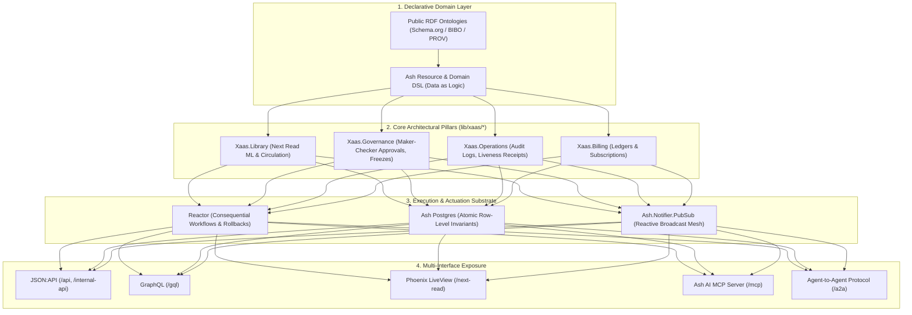

# Ash Framework as the Declarative Substrate for Everything-as-a-Service

> **Diátaxis Quadrant**: Explanation
> **Authority**: Executable Ash Domains (`lib/xaas/*.ex`), Resources, and Reactor Actuation (`Xaas.Actuation`)

---

## 1. The Core Thesis: Why Ash IS the XaaS

In conventional software architectures, "Everything-as-a-Service" (XaaS) platforms suffer from architectural sprawl: business logic is fragmented across HTTP controllers, database ORMs, background job workers, authorization middleware, API serializes, and bespoke WebSocket channels. 

**XaaS takes a radically different approach: Ash Framework IS the platform substrate.**

By modeling the entire application domain as structured, declarative data rather than procedural controller code, Ash Framework provides:
1. **Single Source of Truth**: A single resource definition specifies data storage, validations, lifecycle changes, calculations, authorization policies, and database transactions.
2. **Multi-Interface Convergence**: That single declaration automatically powers JSON:API endpoints, GraphQL schemas, Phoenix LiveView reactive UI bindings, Admin dashboards, and AI Agent MCP (Model Context Protocol) tool calls without glue code.
3. **Atomic Concurrency & Invariants**: Concurrency guarantees (such as inventory decrementing and quota allocations) execute at the database row level via `change atomic_update` and expressions, preventing race conditions.
4. **Governed Consequential Actuation**: Complex side-effecting operations (such as infrastructure provisioning and provider lifecycle transitions) run through Reactor workflows with automatic rollback and cryptographic audit receipts.



---

## 2. Multi-Interface Convergence in Practice

Consider the `Xaas.Library.Book` resource. In a traditional stack, exposing a book catalog requires:
- An Ecto schema and migration.
- Controller actions for REST and JSON rendering views.
- Absinthe GraphQL object types and resolver functions.
- Phoenix Channel / LiveView event handlers and broadcast triggers.
- MCP / OpenAPI tool definitions for LLM agents.

In XaaS, all of these interfaces converge on a single declarative block:

```elixir
defmodule Xaas.Library.Book do
  use Xaas.Resource,
    otp_app: :kanban,
    domain: Xaas.Library,
    data_layer: AshPostgres.DataLayer,
    authorizers: [Ash.Policy.Authorizer],
    notifiers: [Ash.Notifier.PubSub],
    extensions: [AshJsonApi.Resource, AshGraphql.Resource]

  json_api do
    type "library_book"
    routes do
      base "/library/books"
      get :read
      index :read
    end
  end

  graphql do
    type :library_book
  end

  pub_sub do
    module XaasWeb.Endpoint
    prefix "library:books"
    broadcast_type :notification
    publish :borrow_copy, ["inventory", :id]
    publish :borrow_copy, ["events"]
  end

  actions do
    defaults [:read, :destroy]

    update :borrow_copy do
      description "Atomically decrements available shelf copies when checked out"
      validate compare(:available_copies, greater_than: 0), message: "No shelf copies available"
      change atomic_update(:available_copies, expr(available_copies - 1))
    end
  end

  calculations do
    calculate :is_available, :boolean, expr(available_copies > 0)
  end
end
```

### What This Produces Automatically:
1. **JSON:API**: `GET /api/library/books` with standardized filtering, sparse fieldsets, and pagination.
2. **GraphQL**: Query `library_book` with type-safe fields and loaded calculations.
3. **Reactive PubSub**: Publishes `%Ash.Notifier.Notification{}` on `"library:books:events"` whenever a copy is borrowed.
4. **Ash AI MCP Tool**: Exposing `:books_by_grade_band` in `Xaas.Library` makes it an instant tool for Claude, Zed, and Cursor at `/mcp`.
5. **A2A Persona Simulation**: Simulated student agents at `/a2a` interact with the same authorization policies and inventory actions.

---

## 3. Concurrency Safety: Atomic Actions vs. Procedural Race Conditions

A core vulnerability in web applications is the "check-then-act" race condition (e.g. two concurrent students borrowing the last available copy of a book).

### The Flawed Procedural Pattern (Never in XaaS):
```elixir
# ANTI-PATTERN: Prone to race conditions under concurrent requests
book = Repo.get!(Book, id)
if book.available_copies > 0 do
  Repo.update!(Book.changeset(book, %{available_copies: book.available_copies - 1}))
  Repo.insert!(%Checkout{...})
end
```

### The Declarative Ash Pattern (Pure XaaS):
In XaaS, `Checkout.borrow` orchestrates the checkout creation and triggers `Book.borrow_copy` via `Xaas.Library.Changes.DecrementBookInventory`:

```elixir
update :borrow_copy do
  validate compare(:available_copies, greater_than: 0)
  change atomic_update(:available_copies, expr(available_copies - 1))
end
```

Under the hood, Ash compiles this into a single atomic SQL statement:
```sql
UPDATE library_books 
SET available_copies = available_copies - 1 
WHERE id = $1 AND available_copies > 0;
```
If two requests arrive simultaneously for 1 available copy, Postgres atomically serializes the row update. One succeeds and emits a notification; the second returns an atomic validation error without locking or inconsistent state.

---

## 4. Case Study: Next Read Intelligence & Reactive UX

Next Read serves as the end-to-end demonstration of the XaaS architectural model:

1. **Grounded Ontology**: Grounded in `schema:Book`, `bibo:Book`, and `prov:Activity` via RDF Turtle (`priv/packs/xaas_library_pack/ontology.ttl`).
2. **Dynamic 6-Factor Composite ML Ranker**:
   $$\text{Score} = w_{\text{collab}}\cdot \text{collab} + w_{\text{semantic}}\cdot \text{semantic} + w_{\text{grade}}\cdot \text{gradeFit} + w_{\text{avail}}\cdot \text{available} + w_{\text{div}}\cdot \text{diversity} + w_{\text{cur}}\cdot \text{curation}$$
   Backed by local Nx/Bumblebee sentence embeddings.
3. **Reactive Phoenix LiveView**: The student UI at `/next-read` maintains zero mutable state in controller memory, instead subscribing directly to Ash PubSub channels and re-rendering on notification broadcasts.
4. **End-to-End Browser Automation**: Verified with Playwright (`e2e/next-read-ml.spec.js`) validating match percentage displays, live grade switching, and real-time checkout state transitions.

---

## 5. Summary Census of the 8 Ash Domains

The platform comprises 8 Ash domains spanning 74 declarative resources:

| Domain | Module | Resource Count | Functional Responsibility |
|---|---|---|---|
| **Accounts** | `Xaas.Accounts` | 5 | User identity, organizations, tenant memberships, security credentials. |
| **Billing** | `Xaas.Billing` | 7 | Subscriptions, billing tiers, and maker-checker financial approvals. |
| **Ledger** | `Xaas.Ledger` | 4 | Double-entry financial accounts, balances, immutable audit transfers. |
| **Marketplace** | `Xaas.Marketplace` | 2 | Provider lifecycle and status transition approvals. |
| **Operations** | `Xaas.Operations` | 17 | AuditLog entries, capability-liveness receipts, and incident management. |
| **Platform** | `Xaas.Platform` | 7 | Outbound HMAC webhooks, delivery logs, and platform policies. |
| **Governance** | `Xaas.Governance` | 27 | Maker-checker approval gates (CMEK, DR failover, legal hold releases, freeze windows). |
| **Library** | `Xaas.Library` | 5 | Books, Checkouts, Holds, Curations, and RecommendationLogs (Next Read case study). |
