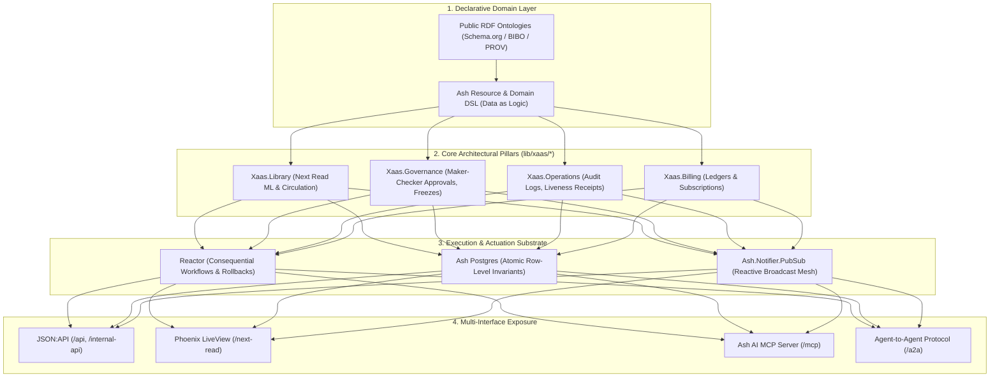

# Ash Framework as the Declarative Substrate for Everything-as-a-Service

> **Diátaxis Quadrant**: Explanation
> **Authority**: Executable Ash Domains (`lib/xaas/*.ex`), Resources, and Reactor Actuation (`Xaas.Actuation`)

---

## 1. The Core Thesis: Why Ash IS the XaaS

In conventional software architectures, "Everything-as-a-Service" (XaaS) platforms suffer from architectural sprawl: business logic is fragmented across HTTP controllers, database ORMs, background job workers, authorization middleware, API serializes, and bespoke WebSocket channels. 

**XaaS takes a radically different approach: Ash Framework IS the platform substrate.**

By modeling the entire application domain as structured, declarative data rather than procedural controller code, Ash Framework provides:
1. **Single Source of Truth**: A single resource definition specifies data storage, validations, lifecycle changes, calculations, authorization policies, and database transactions.
2. **Multi-Interface Convergence**: That single declaration automatically powers JSON:API endpoints, Phoenix LiveView reactive UI bindings, Admin dashboards, and AI Agent MCP (Model Context Protocol) tool calls without glue code.
3. **Atomic Concurrency & Invariants**: Concurrency guarantees (such as inventory decrementing and quota allocations) execute at the database row level via `change atomic_update` and expressions, preventing race conditions.
4. **Governed Consequential Actuation**: Complex side-effecting operations (such as infrastructure provisioning and provider lifecycle transitions) run through Reactor workflows with automatic rollback and cryptographic audit receipts.


```mermaid
graph TD
    subgraph "1. Declarative Domain Layer"
        Ontology["Public RDF Ontologies (Schema.org / BIBO / PROV)"]
        AshDomain["Ash Resource & Domain DSL (Data as Logic)"]
    end

    subgraph "2. Core Architectural Pillars (lib/xaas/*)"
        Library["Xaas.Library (Next Read ML & Circulation)"]
        Governance["Xaas.Governance (Maker-Checker Approvals, Freezes)"]
        Operations["Xaas.Operations (Audit Logs, Liveness Receipts)"]
        Billing["Xaas.Billing (Ledgers & Subscriptions)"]
    end

    subgraph "3. Execution & Actuation Substrate"
        Reactor["Reactor (Consequential Workflows & Rollbacks)"]
        AshPostgres["Ash Postgres (Atomic Row-Level Invariants)"]
        PubSubMesh["Ash.Notifier.PubSub (Reactive Broadcast Mesh)"]
    end

    subgraph "4. Multi-Interface Exposure"
        JsonApi["JSON:API (/api, /internal-api)"]
        LiveView["Phoenix LiveView (/next-read)"]
        McpServer["Ash AI MCP Server (/mcp)"]
        A2AServer["Agent-to-Agent Protocol (/a2a)"]
    end

    Ontology --> AshDomain
    AshDomain --> Library & Governance & Operations & Billing
    Library & Governance & Operations & Billing --> Reactor & AshPostgres & PubSubMesh
    Reactor & AshPostgres & PubSubMesh --> JsonApi & LiveView & McpServer & A2AServer
```

---

## 2. Multi-Interface Convergence in Practice

Consider the `Xaas.Library.Book` resource. In a traditional stack, exposing a book catalog requires:
- An Ecto schema and migration.
- Controller actions for REST and JSON rendering views.
- Phoenix Channel / LiveView event handlers and broadcast triggers.
- MCP / OpenAPI tool definitions for LLM agents.

In XaaS, all of these interfaces converge on a single declarative block:

```elixir
defmodule Xaas.Library.Book do
  use Xaas.Resource,
    otp_app: :xaas,
    domain: Xaas.Library,
    data_layer: AshPostgres.DataLayer,
    authorizers: [Ash.Policy.Authorizer],
    notifiers: [Ash.Notifier.PubSub],
    extensions: [AshJsonApi.Resource]

  json_api do
    type "library_book"
    routes do
      base "/library/books"
      get :read
      index :read
    end
  end

  pub_sub do
    module XaasWeb.Endpoint
    prefix "library:books"
    broadcast_type :notification
    publish :borrow_copy, ["inventory", :id]
    publish :borrow_copy, ["events"]
  end

  actions do
    defaults [:read, :destroy]

    update :borrow_copy do
      description "Atomically decrements available shelf copies when checked out"
      validate compare(:available_copies, greater_than: 0), message: "No shelf copies available"
      change atomic_update(:available_copies, expr(available_copies - 1))
    end
  end

  calculations do
    calculate :is_available, :boolean, expr(available_copies > 0)
  end
end
```

### What This Produces Automatically:
1. **JSON:API**: `GET /api/library/books` with standardized filtering, sparse fieldsets, and pagination.
2. **Reactive PubSub**: Publishes `%Ash.Notifier.Notification{}` on `"library:books:events"` whenever a copy is borrowed.
3. **Ash AI MCP Tool**: Exposing `:books_by_grade_band` in `Xaas.Library` makes it an instant tool for Claude, Zed, and Cursor at `/mcp`.
4. **A2A Persona Simulation**: Simulated student agents at `/a2a` interact with the same authorization policies and inventory actions.

> Note: the GraphQL interface was removed by operator directive 2026-10-07
> ("no GraphQL") — AshGraphql extensions, schema, and HTTP surface deleted
> fix-forward. See `docs/sjira/v26.10.6/plans/w984ao-graphql-removal.md`
> and `docs/claude/diataxis/reference/ash-configuration.md`.

---

## 3. Concurrency Safety: Atomic Actions vs. Procedural Race Conditions

A core vulnerability in web applications is the "check-then-act" race condition (e.g. two concurrent students borrowing the last available copy of a book).

### The Flawed Procedural Pattern (Never in XaaS):
```elixir
# ANTI-PATTERN: Prone to race conditions under concurrent requests
book = Repo.get!(Book, id)
if book.available_copies > 0 do
  Repo.update!(Book.changeset(book, %{available_copies: book.available_copies - 1}))
  Repo.insert!(%Checkout{...})
end
```

### The Declarative Ash Pattern (Pure XaaS):
In XaaS, `Checkout.borrow` orchestrates the checkout creation and triggers `Book.borrow_copy` via `Xaas.Library.Changes.DecrementBookInventory`:

```elixir
update :borrow_copy do
  validate compare(:available_copies, greater_than: 0)
  change atomic_update(:available_copies, expr(available_copies - 1))
end
```

Under the hood, Ash compiles this into a single atomic SQL statement:
```sql
UPDATE library_books 
SET available_copies = available_copies - 1 
WHERE id = $1 AND available_copies > 0;
```
If two requests arrive simultaneously for 1 available copy, Postgres atomically serializes the row update. One succeeds and emits a notification; the second returns an atomic validation error without locking or inconsistent state.

---

## 4. Case Study: Next Read Intelligence & Reactive UX

Next Read serves as the end-to-end demonstration of the XaaS architectural model:

1. **Grounded Ontology**: Grounded in `schema:Book`, `bibo:Book`, and `prov:Activity` via RDF Turtle (`priv/packs/xaas_library_pack/ontology.ttl`).
2. **Dynamic 6-Factor Composite ML Ranker**:
   $$\text{Score} = w_{\text{collab}}\cdot \text{collab} + w_{\text{semantic}}\cdot \text{semantic} + w_{\text{grade}}\cdot \text{gradeFit} + w_{\text{avail}}\cdot \text{available} + w_{\text{div}}\cdot \text{diversity} + w_{\text{cur}}\cdot \text{curation}$$
   Backed by local Nx/Bumblebee sentence embeddings.
3. **Reactive Phoenix LiveView**: The student UI at `/next-read` maintains zero mutable state in controller memory, instead subscribing directly to Ash PubSub channels and re-rendering on notification broadcasts.
4. **End-to-End Browser Automation**: Verified with Playwright (`e2e/next-read-ml.spec.cjs`) validating match percentage displays, live grade switching, and real-time checkout state transitions.

---

## 5. Summary Census of the 8 Ash Domains

> VERIFY 2026-09-26: this census is a point-in-time snapshot predating the current
> 13-domain / 92-resource surface (see `architecture-overview.md`, re-verified 2026-09-22).

The platform comprises 8 Ash domains spanning 74 declarative resources:

| Domain | Module | Resource Count | Functional Responsibility |
|---|---|---|---|
| **Accounts** | `Xaas.Accounts` | 5 | User identity, organizations, tenant memberships, security credentials. |
| **Billing** | `Xaas.Billing` | 7 | Subscriptions, billing tiers, and maker-checker financial approvals. |
| **Ledger** | `Xaas.Ledger` | 4 | Double-entry financial accounts, balances, immutable audit transfers. |
| **Marketplace** | `Xaas.Marketplace` | 2 | Provider lifecycle and status transition approvals. |
| **Operations** | `Xaas.Operations` | 17 | AuditLog entries, capability-liveness receipts, and incident management. |
| **Platform** | `Xaas.Platform` | 7 | Outbound HMAC webhooks, delivery logs, and platform policies. |
| **Governance** | `Xaas.Governance` | 27 | Maker-checker approval gates (CMEK, DR failover, legal hold releases, freeze windows). |
| **Library** | `Xaas.Library` | 5 | Books, Checkouts, Holds, Curations, and RecommendationLogs (Next Read case study). |

---

## Verified 2026-10-07

> **Verified 2026-10-07** (lane W984ik, truth-pass; sibling-modified file, disk state
> read first, append/patch-only, no sibling edits reverted). Claim-by-claim against
> the current tree:
>
> - **Domain/resource architecture**: `config/config.exs:13-33` lists 19
>   `ash_domains` (Library, Accounts, A2a, Billing, Conference, Coupling, Generation,
>   Graphlaw, Governance, Igniter, Ledger, Marketplace, Ocel, Operations, Platform,
>   Security, TemporalMemory, Ultracode, Witness); 115 files under `lib/xaas` declare
>   `use Xaas.Resource`. The Section 5 census (8 domains / 74 resources) and its
>   2026-09-26 VERIFY note (13 domains / 92 resources) are both stale point-in-time
>   snapshots; the live counts above are current truth.
> - **Book resource**: `lib/xaas/library/book.ex` matches the Section 2 sample except
>   as patched — real `otp_app: :xaas` (was misstated `:kanban`), extensions are
>   `[AshJsonApi.Resource, AshAdmin.Resource, AshAi]`, and the real resource carries
>   a BLOCKED-at-infrastructure pgvector/ash_ai `vectorize` block (see its
>   moduledoc) not shown in the illustrative sample. `:borrow_copy` with
>   `validate compare(:available_copies, greater_than: 0)` +
>   `change atomic_update(:available_copies, expr(available_copies - 1))` verified at
>   `book.ex:144-151`; `calculate :is_available` at `book.ex:259`; `json_api` block at
>   `book.ex:95`.
> - **Checkout orchestration (Section 3)**: `Checkout.borrow` +
>   `Xaas.Library.Changes.DecrementBookInventory` calling `Book.borrow_copy` in one DB
>   transaction verified in `lib/xaas/library/reactors/circulation_borrow_reactor.ex`
>   (transaction `:borrow_transaction`, lines 44-81) — the narrative is current.
> - **ggen/Ash manufacture path**: this doc makes no ggen-pack claim; verified
>   separately that `ggen.toml` binds `[ontology] ontology.ttl`,
>   `[templates] templates-hooks`, and locked pack `xaas_castle_bridge`
>   (pinned `b58d7854142bacbd3aeffb83501646cae56c858a`,
>   `packs/xaas-castle-bridge-pack`) — consistent with the CLAUDE.md
>   single-normal-profile doctrine; no marketplace `ash-*` sibling binding exists.
> - **GraphQL reflection**: the Section 2 note is current-truth: AshGraphql
>   extensions/schema/router surface removed fix-forward (receipt
>   `docs/sjira/v26.10.6/plans/w984ao-graphql-removal.md`; residue sweep
>   `docs/sjira/v26.10.6/plans/w984et-probe.md`); sole live residue is
>   `lib/xaas/semantics/vkg.ex:66-67` (`graphql/2` via the `ash_r2rml` consumer,
>   not an HTTP surface); `lib/xaas/operations/audit_log_entry.ex:20` states "no
>   GraphQL surface remains in this codebase". Cross-confirmed at
>   `docs/claude/diataxis/reference/ash-configuration.md:104-109`.
> - **Actuation/authority narrative**: Section 1(4) keeps the governed framing
>   ("Consequential Actuation ... through Reactor workflows") and makes no
>   projection-grants-authority claim; consistent with CLAUDE.md consequential-DO
>   doctrine.
> - **Multi-interface surface**: `/next-read` Live
>   (`lib/xaas_web/router.ex:65`), `/mcp` scope (`router.ex:190`),
>   `/a2a` scope (`router.ex:210`), `/internal-api` forward (`router.ex:286`),
>   `/api` forward (`router.ex:330`); MCP tool `books_by_grade_band` at
>   `lib/xaas/library.ex:20`. E2E spec is `e2e/next-read-ml.spec.cjs` (was
>   misstated `.js`; patched). Ontology file `priv/packs/xaas_library_pack/ontology.ttl`
>   exists.
> - Receipt: `docs/sjira/v26.10.6/plans/w984ik-probe.md`.
> - Note: `docs/sjira/v26.10.6/plans/w650h22-commit.md` does not exist on disk
>   (checked `ls`); no citation to it was added.
